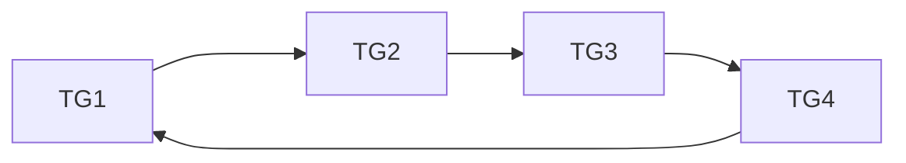
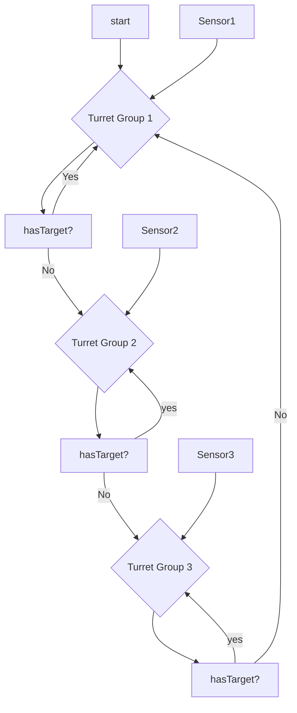

# Turret Cycle Feature Structure


### General Steps
1. Cycling through groups every X seconds
    - if turret has target: v
      - keep cycle in the current group
    - if other sensor goes off then queue up that group


Regarding how switching from groups happens I am thinking event based with a combo of looping.
    - On sensor:
      - If no current queue, instantly switch
      - Else, base on **priority**


Turret System Vars
  - How long to stay on each group
  - Priority of each group
  - How many turrets


FUTURE FEATURES
  - When HBF Module destroyed, add variable for "Added time to cycle" to corresponding turret module cycle
  - Turret module broken detection, remove from the cycle and add again automatically when fixed

```
[T1]=====>
        [T2]=====>
                [T3]=====>
                        [T4]=====>

[T1]=====>
        [EEE]=====?
                [T2]=====>
                        [T3]=====>

```



